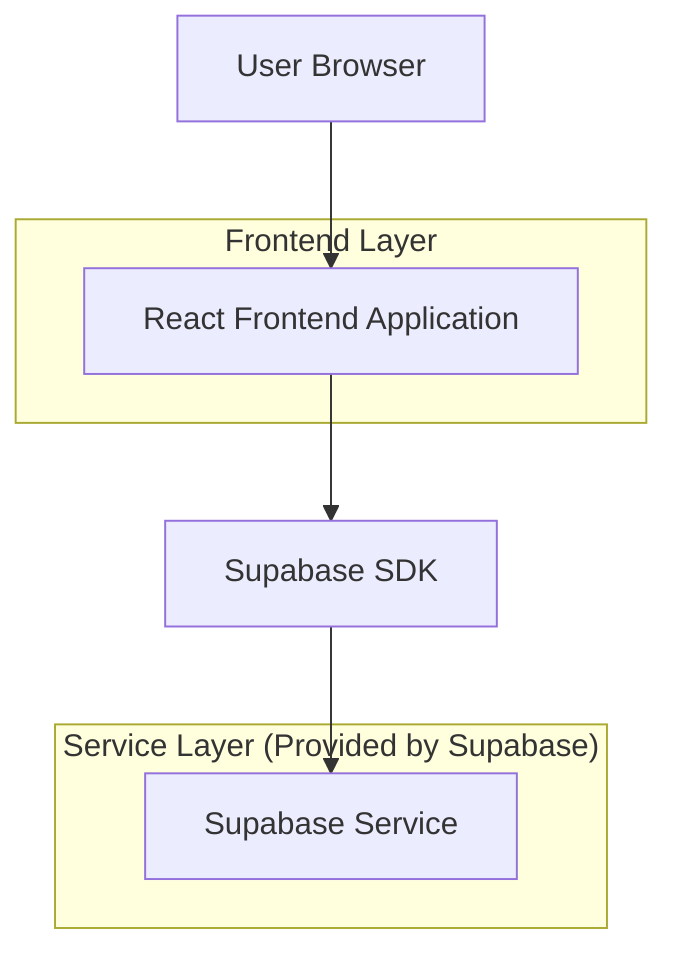

## 1.Architecture design

## 2.Technology Description
- Frontend: React@18 + react-router-dom + tailwindcss@3 + vite
- Backend: Supabase (Auth/DB) (tanpa perubahan untuk scope responsif)

## 3.Route definitions
| Route | Purpose |
|-------|---------|
| /admin | Redirect ke /admin/dashboard untuk admin |
| /admin/dashboard | Halaman admin dashboard |
| /admin/tickets | Halaman event registrations / tickets management |
| /admin/store | Halaman store & inventory |
| /login | Login (dipakai sebelum akses admin) |

## 4.Rencana implementasi (frontend-only)
1. **Refactor `AdminLayout` menjadi responsif (single source of truth)**
   - Mobile (<md): sidebar menjadi **drawer** (off-canvas) + overlay; `main` full width.
   - Desktop (>=md atau >=lg): sidebar tampil permanen (fixed/inline) seperti sekarang.
   - Tambahkan state: `isSidebarOpen` + handler (open/close, click overlay, ESC).
2. **Perbaikan struktur scroll & overflow**
   - Pastikan hanya 1 scroll utama (area konten), hindari nested scroll tak perlu.
   - Tambahkan aturan layout: parent flex/grid memakai `min-h-0` dan children konten `overflow-y-auto`.
   - Terapkan wrapper `overflow-x-auto` untuk blok tabel agar tidak memaksa lebar viewport.
3. **Truncation & flex item shrink (pencegahan “layout melebar”)**
   - Tambahkan `min-w-0` pada container flex yang berisi teks panjang.
   - Terapkan `truncate`/`line-clamp` untuk judul, menu label, dan sel tabel yang panjang.
4. **Konsistensi spacing/padding breakpoint**
   - Mobile padding lebih rapat (mis. px-4) dan desktop tetap (mis. px-8).
   - Header actions wrap: gunakan `flex-wrap`, dan batasi lebar komponen input/button.
5. **Checklist QA (manual, lint-free)**
   - iPhone SE/Android kecil: tidak ada horizontal scroll global.
   - Drawer: open/close stabil, overlay menutup, ESC menutup (desktop keyboard).
   - Tabel: hanya tabel yang bisa horizontal scroll, bukan seluruh halaman.
   - Teks panjang: tidak mendorong layout keluar layar; truncation konsisten.
