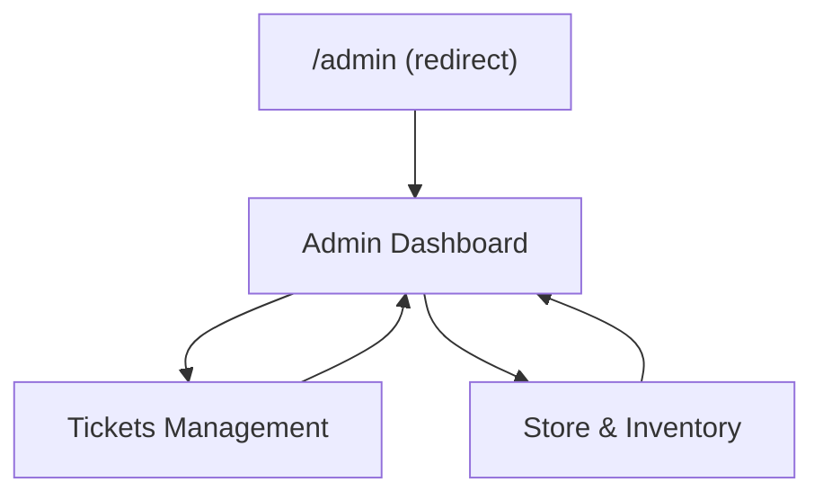

## 1. Product Overview
Memperbaiki layout admin agar benar-benar responsif di mobile: sidebar, header, area konten, overflow, dan truncation.
Fokusnya adalah konsistensi UX di semua halaman admin yang memakai kerangka layout yang sama.

## 2. Core Features

### 2.1 User Roles
| Role | Registration Method | Core Permissions |
|------|---------------------|------------------|
| Admin | Login via halaman Login yang sudah ada | Akses seluruh halaman admin dan navigasi admin |

### 2.2 Feature Module
Perbaikan admin terdiri dari halaman-halaman utama berikut:
1. **Kerangka Layout Admin (Global)**: sidebar responsif (drawer di mobile), header responsif, area konten dengan scroll yang benar, kebijakan overflow/truncation konsisten.
2. **Admin Dashboard**: menerapkan kerangka layout global; memastikan kartu/statistik dan tabel tetap terbaca di mobile tanpa “kepotong”.
3. **Event Registrations (Tickets Management)**: menerapkan kerangka layout global; memastikan tabel/list dapat diakses di mobile (scroll horizontal terkontrol atau tampilan card).
4. **Store & Inventory**: menerapkan kerangka layout global; memastikan grid/card dan panel detail tidak memicu overflow; teks panjang ter-truncate dengan benar.

### 2.3 Page Details
| Page Name | Module Name | Feature description |
|-----------|-------------|------------------|
| Kerangka Layout Admin (Global) | Sidebar responsif | Menyembunyikan sidebar di layar kecil; membuka via tombol hamburger; menampilkan sebagai drawer dengan overlay dan tombol close; menjaga fokus/aksesibilitas dasar (ESC menutup, klik overlay menutup). |
| Kerangka Layout Admin (Global) | Header responsif | Menampilkan judul + subjudul yang wrap/truncate aman; menempatkan header actions agar tidak mendorong layout melebar; membuat header sticky (opsional) di mobile agar navigasi tetap mudah. |
| Kerangka Layout Admin (Global) | Konten & scroll container | Mengunci scroll hanya pada area konten (bukan memicu scroll ganda); memastikan container punya `min-h-0`/`min-w-0` sehingga flex/grid tidak memaksa overflow. |
| Kerangka Layout Admin (Global) | Overflow & truncation policy | Menerapkan aturan: teks panjang pakai `truncate`/`line-clamp`; komponen lebar (tabel) dibungkus `overflow-x-auto`; mencegah “layout melar” pada chip/badge/button. |
| Admin Dashboard | Responsif komponen ringkasan | Menampilkan kartu ringkasan menjadi 1 kolom di mobile, 2 di tablet, multi kolom di desktop; menjaga gap/padding sesuai breakpoint. |
| Admin Dashboard | Responsif tabel/daftar | Menghindari tabel memaksa lebar layar; mengaktifkan scroll horizontal terkontrol atau memecah ke layout card; menjaga header kolom tidak terpotong. |
| Tickets Management | Responsif area filter/aksi | Membuat bar aksi (mis. tombol/controls yang sudah ada) wrap ke baris baru; memastikan komponen input/select tidak melebar keluar layar. |
| Tickets Management | Responsif tabel utama | Menyediakan container `overflow-x-auto` + sticky header (bila ada) dan truncation pada sel panjang; menjaga tombol aksi per-row tetap bisa di-tap di mobile. |
| Store & Inventory | Responsif grid & card | Mengatur grid jadi 1 kolom di mobile; memastikan gambar/thumbnail tidak memicu overflow; truncation pada judul item dan meta. |
| Store & Inventory | Responsif detail konten | Menjaga panel/section panjang tetap bisa discroll; memastikan modal/popover (jika ada) muat di mobile tanpa terpotong. |

## 3. Core Process
**Alur Admin (Mobile):**
1. Admin membuka salah satu halaman admin.
2. Header menampilkan tombol hamburger.
3. Admin membuka drawer sidebar untuk pindah halaman.
4. Admin membaca/mengelola konten; bila ada tabel lebar, admin dapat menggeser horizontal di area tabel (tanpa menggeser seluruh halaman).
5. Teks panjang pada menu/judul/sel tabel akan wrap atau ter-truncate sesuai aturan sehingga tidak merusak layout.

