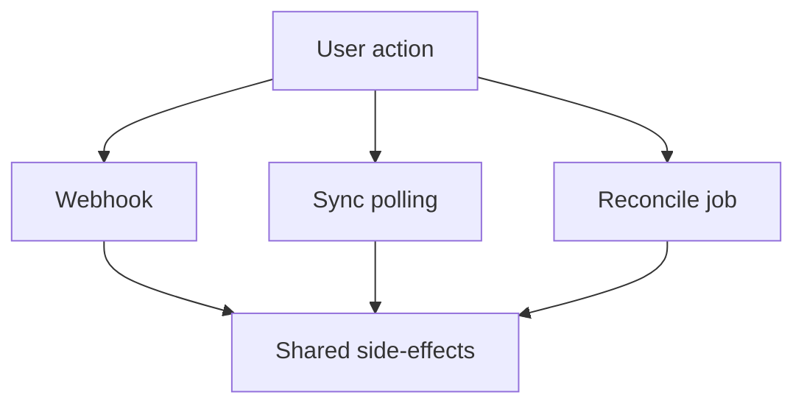

# Midtrans Payment Hardening Plan (3-Layer)

## Objectives and Success Criteria
- Paid ticket orders always result in tickets being issued and capacity finalized, even if the webhook fails.
- Failed or expired ticket orders always release reserved capacity.
- Paid product orders always have pickup codes and consistent stock updates, even if the webhook fails.
- Failed or expired product orders always release reserved stock.
- All side-effects are idempotent and can be safely re-run from sync or reconciliation.

Key references:
- Ticket sync: [`sync-midtrans-status`](supabase/functions/sync-midtrans-status/index.ts:1)
- Product sync: [`sync-midtrans-product-status`](supabase/functions/sync-midtrans-product-status/index.ts:1)
- Webhook side-effects: [`midtrans-webhook`](supabase/functions/midtrans-webhook/index.ts:1)
- Existing flow docs: [`MIDTRANS_INTEGRATION.md`](MIDTRANS_INTEGRATION.md:1)

## Layer 1: Shared Side-Effects (Single Source of Truth)
**Goal:** Remove divergence between webhook and sync logic.

Proposed shared module:
- New helper: [`payment-effects`](supabase/functions/_shared/payment-effects.ts:1)

### Ticket side-effects helper
- Inputs: order_number, order_id, current status, order_items.
- Behavior when paid:
  - Compute required ticket count per order item.
  - Count existing tickets per order item.
  - Insert only missing tickets.
  - Finalize capacity only for the missing quantity.
- Behavior when expired or failed or refunded:
  - Release reserved capacity for each selected slot.
  - Guard with an idempotency marker so release is not double-applied.

### Product side-effects helper
- Inputs: order_number, order_id, payment status, order items, current stock data.
- Behavior when paid:
  - Generate pickup code only when missing.
  - Validate stock or amount mismatch and flag for review when needed.
- Behavior when expired or failed or refunded:
  - Release reserved stock only once, using an idempotency marker.

### Recommended idempotency markers
This avoids double release on retries or reconciliation.
- Ticket orders: add markers such as tickets_issued_at and capacity_released_at on the order record.
- Product orders: add stock_released_at on the order record.

If migrations are not desirable right now, a fallback is to check existing issued tickets and only release capacity when a release log marker exists in webhook logs, but the marker columns are the safer option.

## Layer 2: Harden Sync Functions
**Goal:** Sync functions should close the webhook-failure gap.

### Ticket sync
Update [`sync-midtrans-status`](supabase/functions/sync-midtrans-status/index.ts:1) to call the shared ticket side-effects helper:
- If Midtrans status is paid, issue missing tickets and finalize capacity.
- If status is expired or failed or refunded, release reserved capacity once.

### Product sync
Update [`sync-midtrans-product-status`](supabase/functions/sync-midtrans-product-status/index.ts:1) to call the shared product side-effects helper:
- If Midtrans status is paid, generate pickup code and validate stock.
- If status is expired or failed or refunded, release reserved stock once.

## Layer 3: Reconciliation Job
**Goal:** Self-heal inconsistent states that slip through.

### New scheduled function
- New function: [`reconcile-midtrans-payments`](supabase/functions/reconcile-midtrans-payments/index.ts:1)
- Schedule: daily or hourly, depending on risk tolerance.

### Reconciliation checks
- Paid ticket orders missing tickets or missing capacity finalization.
- Failed or expired ticket orders still holding capacity.
- Paid product orders missing pickup codes or missing stock confirmations.
- Failed or expired product orders still holding reserved stock.

### Repair strategy
- Re-run the same shared side-effects helper for each mismatch.
- Log each repair into webhook logs with event_type values like reconcile_fix_ticket_issued or reconcile_release_stock.

## Monitoring and Alerting
**Goal:** Make failures observable.

- Extend webhook log entries for sync and reconciliation runs with per-run totals.
- Alert thresholds examples:
  - Webhook verification failures above a threshold per hour.
  - Mismatch count above a threshold per day.
  - Reconciliation repairs above a threshold per day.

## Test Plan and Runbook
**Goal:** Prove resilience and document manual fallback.

### Test scenarios
- Simulate webhook failure, pay via Midtrans, confirm sync issues tickets or pickup code.
- Simulate payment expiry, confirm reserved capacity or stock is released.
- Simulate late webhook delivery, confirm idempotent side-effects do not double apply.

### Runbook updates
- Add audit queries and manual recovery steps in [`MIDTRANS_INTEGRATION.md`](MIDTRANS_INTEGRATION.md:1).
- Add notes on reconciliation schedule and log interpretation.

## High-Level Flow

## Decision Points
- Confirm whether schema markers are acceptable (recommended) or whether to use log-based guards.
- Confirm reconciliation frequency and alert thresholds.

## Implementation Order
1) Add shared side-effects helper and update webhook and sync to reuse it.
2) Add idempotency markers via migration.
3) Implement reconciliation job and schedule it.
4) Add monitoring and update runbook.

This plan completes the 3-layer hardening without changing the customer-facing flow.